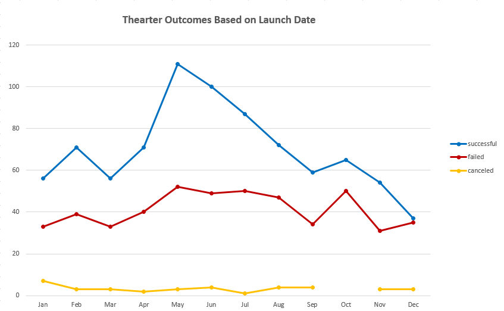
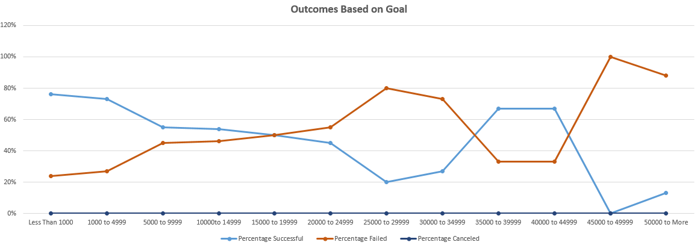

# Kickstarting with Excel
## Overview of Project 

Louise, an upcoming playwright wants to start a crowdfunding campaign to help fund her play, "Fever".  Louise's play Fever came close to its fundraising goal in very short time. She therefore wanted to know how different campaigns fared in relation to their launch dates and their funding goals. By analyzing the campaign data and visualizing the outcomes based on their launch dates and their funding goals, this project will provide Louise the desired insights for the campaign.These insights will enable Louise to plan her campaign and set it up for success. 
### Purpose

The purpose of the data analysis was to gather insights and draw data driven conclusions based on the findings. In analyzing the crowdfunding data there were several data variables to consider, such as the categories and subcategories of the projects, the backers for each project, average donations per campaign, duration for which each project was held, goal amount, pledged amount,country where the campaign was held and the outcomes for the projects. 

The findings through the step by step analysis was meant to give Louise an in-depth understanding on the different campaign performances. This is meant to help in discovery of what worked well, what did not work so well and would would be some ways to invest time and efforts that are more likely to be successful. In some cases the data trends may also help to point out the weak areas to address or improvise on. 

For example: overall kickstarter data analysis pointed out that the theater category and music related campaign projects were most successful. Journalism, food, games, photography and publishing were not as many in number and also did not have a high success rate. As Louise intends to start crowdfunding to fund her play, she is well situated in the project which is likely to be successful based on a broader look at campaign data. Further drilling into the theater category and play as subcategory would reveal on aspects that carry some takeaways for Louise to be well informed to meet her fundraising goals. 

## Analysis and Challenges

### Analysis of Outcomes Based on Launch Date

For this project, as a data analyst the first task was to size the data and get a feel for what is to be worked on and how to proceed with the analysis. Some of the important considerations for the kickstarter data were to confirm the number of columns and rows, and understand how the data was structured, and whether it is readable or needed to be converted in some way. Using the format, sort and filter the data pattern and some broader level assessment was conducted before proceesign with the pivot table analysis. The campaign data through the pivot table analysis was arranged so that for the parent category and years set as filters, the outcomes such as 'successful', 'failed' and 'canceled' for the count of outcome values across the launch date year would display as follows. 
Outcomes_vs_Launch.png
Looking at the outcomes based on launch date, the projects that started in May, June and Feb were most successful. The same pattern held true looking at all all parent categories, and in looking specifically at the 'theater' category. Failed campaigns for the Theater category were nearly similar in count from May through August. 

### Analysis of Outcomes Based on Goals

In the analysis on the outcome based on goals, there were no cancelled projects for the sub category 'Play'. While plays had variable goal amount for fund raise, the most conservative goals in the range of less than $5000 had 76% success rate. Following line graph summarizes the number of successful, failed and canceled projects by months. 
Following graph shows the trends across the goal amounts

### Challenges and Difficulties Encountered

The deadline and launched_at columns in the kickstarter data contaned Unix timestamps rather than dates and these needed to be converted into standard date format so that they would be readable. This can often be challenging in large data sets to identify what the data variables represent  and in absence of column headers or large amount of raw data without essential details it becomes time consuming to decipher which data variables would need to be converted. In this case as the information on data was well provided this did not pose much of a problem, and only needed correct conversion formula to make the dates readable. 

One of the real world limitations in analyzing large amount of data is the usage of appropriate tools based on the data being structured versis unstructured. Data that is unstructured would need more sophisticated analytical tools and using excel for analysis is only feasible as the kickstarter data is structured data. 

Some of the general challenges that arise in excel data analysis is to find outliers from large amount of data and to be able to exclude these so that the data is not skewed. Several extrinsic factors can influence the outcomes and the results can often miss the entire story if all the variables are not taken into consideration. Goal amount, category of projects and their subcategories, duration of each fundraiser project, backers for each project are some of the known variables and looking at several factors and addition of variables can make correction interpretations a time consuming process. 

## Results

In conclusion from the analysis of the Theater Outcomes by Launch Date while the success and failure is spread out through out all the months for each outcome, the summer months of May and June are best months to set for success for the theater campaign. Based on the mean and median of 70 and 68 respectively for successful theater outcomes, this data is symmetric. 
The cancellations are low in number for the theater category, howeer January is the month with relatively most cancellations. It would be advisable to hold off having theater campaigns in January. 

Looking deeper in the outcomes based on the goals, higher the goal less sparse were the projects and failure rate was twice as high for those with goal over $25000.Failure for projects with goal of over $50000 was 88% indicating that the higher goal amount had some role to play for the failures in this specific goal range.

Looking at large data set involves making some assumptions, and hence one of the limitations of this analysis is that only few variables were looking at in details. To further deep dive, looking at the subcategory of 'play' and further identify specific plays that are successful versus not, seasonal success factors, trends of outcomes across regions based on type of plays and data on backers would empower Louise to use the findings for more targetted fund raising for the play 'Fever'.

